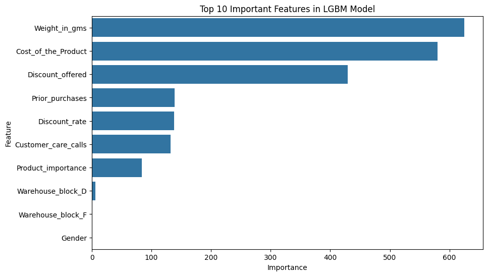

# E-commerce 'Order-He's Shipping Data Classification ML Project
### **Order-He 배송 데이터를 활용한 고객 평점 분석 및 배송 정시 도착 예측 모델 구축**

> 👉 [View README in English)](README.md)
---

## 1. 프로젝트 개요

본 프로젝트는 가상의 이커머스 서비스 ‘Order-He’의 배송 데이터를 바탕으로 다음 두 가지 문제를 해결하고자 합니다:

1. 고객 평점에 영향을 주는 요인을 분석하여 고객 만족도 향상 방안을 제시
2. 머신러닝(Machine Learning)을 활용해 배송이 정시에 도착할지를 예측하는 모델 구축

> **목표**: 데이터 기반 의사결정을 통해 고객 경험을 개선하고, 운영 효율을 높일 수 있는 시스템 설계

---

## 2. 사용 라이브러리

- **기본 처리**: `os`, `pickle`
- **데이터 분석**: `pandas`, `numpy`, `scipy`, `scikit-learn`
- **시각화**: `matplotlib`, `seaborn`, `missingno`
- **머신러닝 모델**: `xgboost`, `lightgbm`

---

## 3. 데이터 설명 및 전처리

- **데이터 출처**: [Kaggle - Customer Analytics](https://www.kaggle.com/datasets/prachi13/customer-analytics)
- **총 11개 feature + 1개 타깃 변수**

| 컬럼명 | 설명 |
|--------|------|
| ID | 고객 식별자 |
| Warehouse_block | 상품 보관 창고 구역 (A~F) |
| Mode_of_Shipment | 배송 방식 (Ship, Flight, Road) |
| Customer_care_calls | 고객센터 상담 횟수 |
| Customer_rating | 고객 평점 (1~5점) |
| Cost_of_the_Product | 상품 가격 |
| Prior_purchases | 이전 구매 횟수 |
| Product_importance | 상품 중요도 (low, medium, high) |
| Gender | 성별 (M/F) |
| Discount_offered | 제공된 할인 비율 |
| Weight_in_gms | 상품 무게 (그램 단위) |
| Reached.on.Time_Y.N | 배송 정시 도착 여부 (0: 정시, 1: 지연) |

### 📌 주요 전처리 작업

- **라벨 인코딩**: Gender, Product Importance, Reached.on.Time_Y.N
- **원-핫 인코딩**: Mode_of_Shipment, Warehouse_block
- **목표 변수 재설정**: `Reached.on.Time_Y.N` → 1: 정시 도착(Y), 0: 지연(N)

---

## 4. 분석 1: 고객 평점 영향 요인 분석

- 고객 평점과 다른 변수들 간의 상관관계를 분석하였으며, 유의미한 변수로는 다음이 도출됨:

  - **양의 상관관계**: Prior_purchases, Customer_care_calls
  - **음의 상관관계**: Reached.on.Time_Y.N, 할인Discount_offered

- 하지만 전체적으로 **상관계수가 약하고**, 고객 평점에 명확한 영향을 주는 요인은 도출되지 않음

> 👉 결론: 고객 평점 예측을 위한 모델링에는 적합하지 않음 → 더 많은 양의 실제 데이터를 통해 분석이 필요

---

## 5. 분석 2: 배송 정시 도착 예측 모델

### 🛠️ 모델링 절차

1. **타깃 변수**: Reached.on.Time_Y.N (0=지연, 1=정시)
2. **사용 모델**:
   - 로지스틱 회귀(Logistic Regression)
   - SVM
   - 랜덤포레스트(Random Forest)
   - 그래디언트 부스팅(Gradient Boosting)
   - XGBoost
   - LightGBM
3. **평가지표**:
   - 정확도(Accuracy), 정밀도(Precision), 재현율(Recall), F1-score
4. **교차 검증**: Stratified K-Fold 사용
5. **하이퍼파라미터 튜닝**: Randomized Search → Grid Search

### ✅ 모델 성능 요약

- **챔피언 모델**: LightGBM
- **하이퍼파라미터**:
  ```python
  {'colsample_bytree': 1.0, 'learning_rate': 0.01, 'max_depth': 3,
   'min_child_samples': 10, 'n_estimators': 400, 'subsample': 1.0}
  ```
- **📈 모델 평가 지표**

- `정확도 (Accuracy)`: 68%
- `재현율 (Recall)`: 95%
- `정밀도 (Precision)`: 56%

> - **해석**  
    + 정시 도착(Positive)을 놓치지 않고 잘 예측(FN이 적음)하여,  
    + 고객 신뢰 확보에 유리한 모델로 판단됩니다.

---

### 📊 Confusion Matrix

| 실제 / 예측 | 예측: 지연 (0) | 예측: 정시 (1) |
|-------------|----------------|----------------|
| 실제: 지연 (0) | TN (True Negative): 1013 | FP (False Positive): 975 |
| 실제: 정시 (1) | FN (False Negative): 65   | TP (True Positive): 1247 |

- **TP (정시 → 정시 예측)**: 1247건  
- **TN (지연 → 지연 예측)**: 1013건  
- **FP (지연 → 정시 예측)**: 975건  
- **FN (정시 → 지연 예측)**: 65건

> ✅ **해석**
> - **FP**: 고객이 기대보다 빠르게 받았다고 느낄 수 있어 서비스에 큰 악영향은 없음  
> - **FN**: 실제 정시에 도착했지만 지연으로 잘못 예측 → 고객 불만 가능성 ↑  
> → **FN을 줄이는 것이 중요하며, 본 모델은 FN이 적어 실무 활용에 적합함**

---

### ⭐ Feature 중요도 상위 10개



---

## 6. 결과 활용 방안

- **고객 평점 분석**  
  - 현재 데이터는 상관관계가 약하여 평점 예측에 적합하지 않음  
  - → 향후 더 많은 데이터를 수집 후 재분석 필요

- **배송 정시 도착 예측 모델**  
  - 해당 모델을 자사 홈페이지에 적용하면, 고객이 주문 시 정시 도착 가능성을 확인 가능  
  - → 신뢰도를 높이고 주문 전환율 증가 기대

---

## 7. 한계 및 주의사항

- 해당 데이터는 Kaggle에서 수집된 공공 데이터입니다.
- 실제 서비스 환경과는 차이가 있으며, 일부 컬럼이 현실적이지 않을 수 있습니다.
- 실무 적용을 위해서는 **실제 배송 이력 데이터를 기반으로 모델을 재학습**하는 것이 필요합니다.

---

## 8. 부록

- **작성자**: DS_Yujin LEE  
- **작성일**: 2025-04-11 ~ 2025-04-24  
- **버전**: v1.3  
- **데이터 출처**: [Kaggle - Customer Analytics](https://www.kaggle.com/datasets/prachi13/customer-analytics)
- **최근수정일**: 2025-05-23

---
